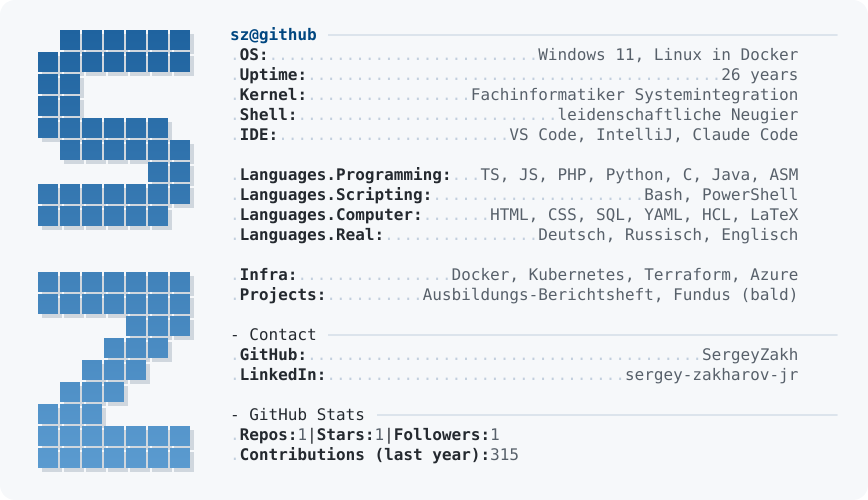

<picture>
  <source media="(prefers-color-scheme: dark)" srcset="dark_mode.svg">
  
</picture>

[LinkedIn](https://www.linkedin.com/in/sergey-zakharov-jr/) · [Ausbildungs-Berichtsheft](https://github.com/SergeyZakh/Ausbildungs-Berichtsheft)
